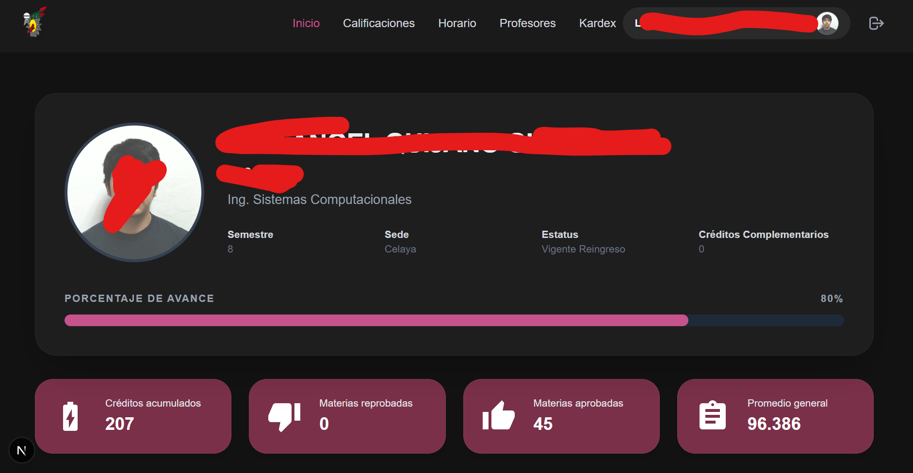
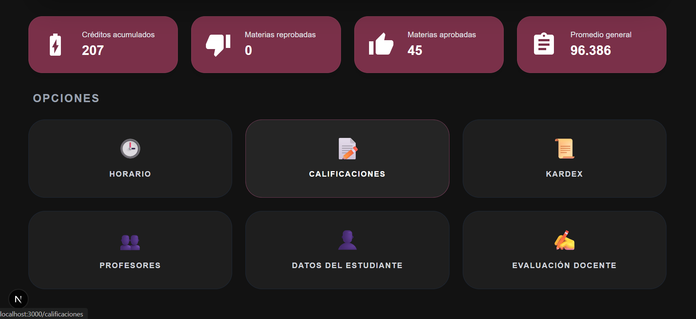
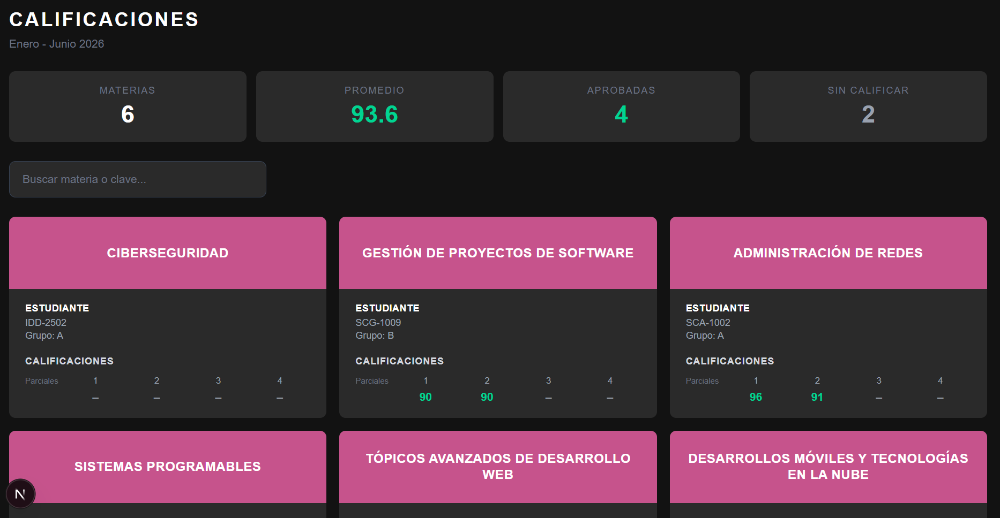
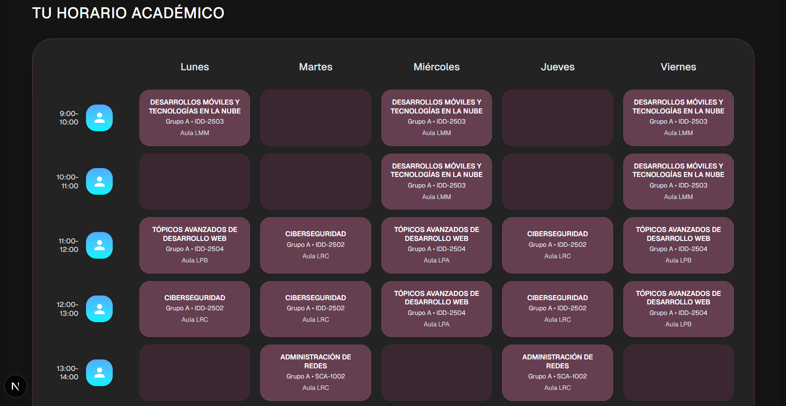
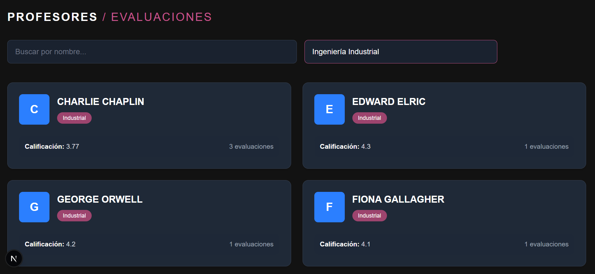
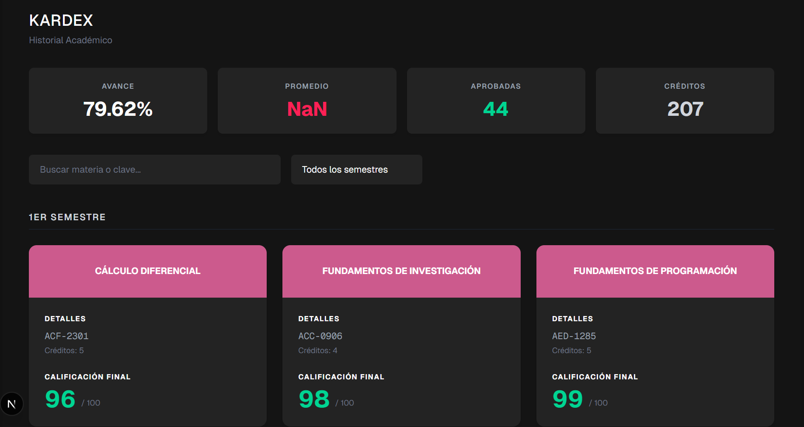

# Sistema de Información Académica Estudiantil

[cite_start]Este proyecto es una aplicación web desarrollada para consumir los servicios REST del sistema SII ITC. [cite_start]Permite al usuario autenticarse y visualizar su información académica de manera estructurada, incluyendo datos personales, calificaciones, kardex y horarios.

## Enlace del proyecto

Puedes acceder a la versión en producción de la aplicación aquí:
[cite_start][Insertar link de Vercel o Render aquí] 

## Tecnologías utilizadas

### Frontend: Next.js
El frontend de la aplicación está construido con Next.js, un framework basado en React. [cite_start]Se eligió esta tecnología principalmente por su manejo de rutas integrado (App Router) y su soporte para renderizado en el servidor (SSR) y generación de sitios estáticos (SSG), lo que facilita crear aplicaciones rápidas y robustas.

### Backend (Funcionalidad Extra): NestJS y Supabase
[cite_start]Para cumplir con el requerimiento de una funcionalidad adicional con un backend propio [cite_start], se desarrolló un módulo de Evaluación Docente. 
Este módulo utiliza NestJS para la creación de una API REST y Supabase como base de datos relacional (PostgreSQL). La funcionalidad permite a los estudiantes visualizar una lista de profesores, filtrar por departamento, y abrir un modal para consultar estadísticas detalladas (promedios, conteos por modalidad) y leer comentarios de evaluaciones anteriores.

## Arquitectura del proyecto

El código fuente del frontend está organizado bajo la siguiente estructura de carpetas para separar las responsabilidades de forma clara:

* **app/**: Contiene las rutas, los layouts y las páginas principales de la aplicación.
* **components/**: Almacena los componentes reutilizables de React, tanto elementos comunes (botones, inputs) como partes específicas de la interfaz (tarjetas, modales).
* **services/**: Incluye las funciones encargadas de realizar las peticiones HTTP (fetch) hacia la API del SII y hacia la API de profesores.
* **types/**: Archivos donde se definen las interfaces y los tipos de datos para mantener el tipado estricto con TypeScript.
* **hooks/**: Directorio destinado a los hooks personalizados de React.
* **lib/**: Funciones de lógica general o utilidades (helpers).
* **public/**: Archivos estáticos del proyecto, como imágenes y logotipos.

## Características principales

El proyecto implementa los siguientes módulos:
* [cite_start]**Autenticación:** Inicio de sesión que consume el endpoint `/api/login` y maneja el acceso mediante un token JWT.
* [cite_start]**Perfil del Estudiante:** Pantalla principal que muestra los datos del usuario obtenidos del endpoint `/api/movil/estudiante`.
* [cite_start]**Calificaciones:** Vista que presenta las materias y calificaciones del periodo actual con indicadores visuales.
* [cite_start]**Kardex y Horario:** Secciones independientes para consultar el historial académico completo y las clases organizadas por día y hora.
* **Evaluación de Profesores (Extra):** Plataforma para buscar docentes y ver sus métricas de evaluación de forma detallada.

## Instalación y ejecución local

[cite_start]Para correr este proyecto en tu equipo, asegúrate de tener Node.js instalado y sigue estos pasos:

1. Clona el repositorio:
   ```bash
   git clone [Insertar URL de tu repositorio aquí]
   ```
2. Ingresa al directorio del proyecto e instala las dependencias:
   ```bash
   npm install
   ```
3. Inicia el servidor de desarrollo:
   ```bash
   npm run dev
   ```
4. Abre `http://localhost:3000` en tu navegador para ver la aplicación funcionando.

## Capturas de pantalla














